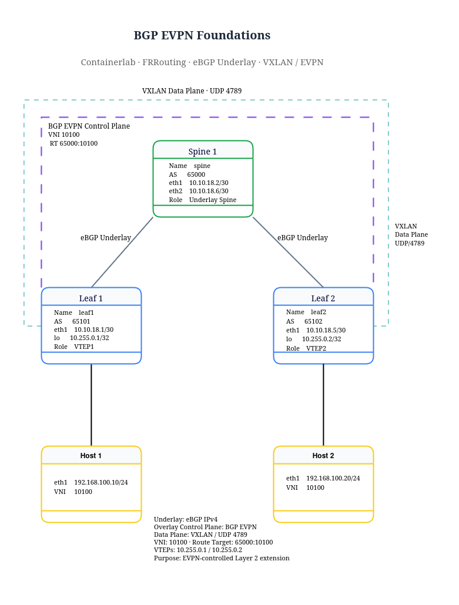

# EVPN Fabric Automation

Hands-on EVPN/VXLAN lab built with **Containerlab, FRRouting, Linux networking, Python and Netmiko**.

The project focuses not only on building an EVPN fabric, but also on validating it automatically, detecting failures and correlating control-plane state with Linux VXLAN dataplane behavior.

---

## Overview

This lab implements a small BGP EVPN/VXLAN fabric with:

- 2 Leaf switches
- 1 Spine
- 2 Linux hosts
- eBGP IPv4 underlay
- eBGP EVPN overlay
- VXLAN VNI 10100
- Linux bridge dataplane
- FRRouting control plane
- Python / Netmiko automated health checks

The main goal is to reproduce a simplified modern Data Center fabric and develop automated troubleshooting logic around it.

---

## Topology



### Addressing Summary

| Node | AS | Loopback / VTEP |
|---|---:|---|
| Leaf1 | 65101 | 10.255.0.1 |
| Spine | 65000 | 10.255.0.254 |
| Leaf2 | 65102 | 10.255.0.2 |

**VNI:** 10100  
**Tenant subnet:** 192.168.100.0/24

### Underlay

```text
Leaf1 --- 10.10.18.0/30 --- Spine
Leaf2 --- 10.10.18.4/30 --- Spine
```

### Overlay

```text
Leaf1 VTEP: 10.255.0.1
Leaf2 VTEP: 10.255.0.2

VNI: 10100
UDP: 4789
```

---

## Architecture

The project separates the network into two logical planes.

### Underlay

The IPv4 underlay provides IP reachability between the VTEP loopbacks.

BGP autonomous systems:

```text
Leaf1: AS 65101
Spine: AS 65000
Leaf2: AS 65102
```

### Overlay

The EVPN control plane exchanges:

- EVPN Type-2 MAC routes
- EVPN Type-3 Inclusive Multicast routes
- VTEP reachability
- Route Target information

Both Leafs use:

```text
Route Target: 65000:10100
VNI: 10100
```

The Linux dataplane uses:

```text
br100
vxlan100
```

---

## Project Structure

```text
evpn-fabric-automation/
├── configs/
│   ├── leaf1/
│   ├── leaf2/
│   └── spine/
├── docs/
├── images/
├── reports/
├── scripts/
│   ├── leaf1-vxlan.sh
│   ├── leaf2-vxlan.sh
│   ├── netmiko_health_check.py
│   ├── netmiko_multi_node.py
│   └── validate_fabric.py
├── topology/
│   └── lab08.clab.yml
├── .gitignore
└── README.md
```

---

## Requirements

Tested with:

- Linux / Ubuntu
- Docker
- Containerlab
- FRRouting
- Python 3
- Netmiko

Recommended Python virtual environment:

```bash
python3 -m venv .venv
source .venv/bin/activate
pip install netmiko
```

---

## Deploy the Fabric

From the repository root:

```bash
sudo containerlab deploy -t topology/lab08.clab.yml
```

Verify containers:

```bash
docker ps
```

Expected nodes:

```text
clab-lab08-leaf1
clab-lab08-spine
clab-lab08-leaf2
clab-lab08-host1
clab-lab08-host2
```

---

## Configure the VXLAN Dataplane

Copy the helper scripts into the leaf containers:

```bash
docker cp scripts/leaf1-vxlan.sh \
clab-lab08-leaf1:/tmp/leaf1-vxlan.sh

docker cp scripts/leaf2-vxlan.sh \
clab-lab08-leaf2:/tmp/leaf2-vxlan.sh
```

Execute them:

```bash
docker exec clab-lab08-leaf1 sh /tmp/leaf1-vxlan.sh
docker exec clab-lab08-leaf2 sh /tmp/leaf2-vxlan.sh
```

Verify:

```bash
docker exec clab-lab08-leaf1 ip -d link show vxlan100
docker exec clab-lab08-leaf2 ip -d link show vxlan100
```

---

## Automated Fabric Health Check

Run:

```bash
python scripts/netmiko_health_check.py
```

Healthy output:

```text
[ UNDERLAY BGP ]
Leaf1 -> Spine BGP                         PASS
Leaf2 -> Spine BGP                         PASS
Spine -> Leaf1/Leaf2 BGP                   PASS

[ EVPN CONTROL PLANE ]
Leaf1 EVPN peer                            PASS
Leaf2 EVPN peer                            PASS

[ SERVICE POLICY ]
Leaf1 RT 65000:10100                       PASS
Leaf2 RT 65000:10100                       PASS

[ VXLAN / VNI ]
Leaf1 VNI 10100                            PASS
Leaf2 VNI 10100                            PASS
Leaf1 remote VTEP                          PASS
Leaf2 remote VTEP                          PASS

[ DATA PLANE ]
Host1 -> Host2                             PASS

[ EVPN MAC LEARNING ]
Leaf1 local MAC                            PASS
Leaf1 remote MAC                           PASS
Leaf2 local MAC                            PASS
Leaf2 remote MAC                           PASS

FABRIC STATUS: HEALTHY
```

---

## Troubleshooting Scenarios

### Scenario 1 — Route Target Mismatch

Expected RT:

```text
65000:10100
```

Faulty RT:

```text
65099:10100
```

Symptoms:

```text
Underlay BGP              PASS
EVPN session              PASS
VNI                       PASS
EVPN MAC learning         FAIL
Host connectivity         FAIL
```

Recovery:

```text
route-target import 65000:10100
route-target export 65000:10100
```

### Scenario 2 — EVPN Next-Hop Validation Failure

Leaf1 received Leaf2's EVPN Type-2 and Type-3 routes but initially rejected the EVPN next-hop.

Key command:

```bash
vtysh -c "show bgp nexthop"
```

Observed:

```text
10.255.0.2 invalid
Must be Connected
```

Underlay reachability itself worked:

```bash
ping -I 10.255.0.1 10.255.0.2
```

Fix on Leaf1:

```text
neighbor 10.255.0.2 ebgp-multihop 2
neighbor 10.255.0.2 disable-connected-check
neighbor 10.255.0.2 update-source 10.255.0.1
```

Fix on Leaf2:

```text
neighbor 10.255.0.1 ebgp-multihop 2
neighbor 10.255.0.1 disable-connected-check
neighbor 10.255.0.1 update-source 10.255.0.2
```

After the change:

```text
EVPN next-hop            VALID
Remote MAC               INSTALLED
Remote VTEP              INSTALLED
Host1 -> Host2            PASS
FABRIC STATUS             HEALTHY
```

---

## Troubleshooting Methodology

```text
1. Underlay BGP
        ↓
2. VTEP reachability
        ↓
3. EVPN BGP session
        ↓
4. Route Target import/export
        ↓
5. EVPN Type-2 / Type-3 routes
        ↓
6. BGP next-hop validation
        ↓
7. VNI state
        ↓
8. Linux VXLAN FDB
        ↓
9. MAC learning
        ↓
10. End-to-end host connectivity
```

---

## Key Lessons Learned

- **BGP adjacency is not service validation.**
- **Route Targets control EVPN service membership.**
- **Received does not mean usable.**
- **Kernel reachability and BGP next-hop validation are different.**
- **Automation must understand protocol behavior and validation order.**

---

## Useful Commands

```bash
show bgp l2vpn evpn summary
show bgp l2vpn evpn
show bgp l2vpn evpn route type multicast
show evpn vni
show evpn mac vni 10100
show bgp nexthop
```

```bash
ip -d link show vxlan100
bridge link
bridge fdb show
ip route
ip neigh
```

---

## Roadmap

- More reliable parsing of FRRouting output
- JSON-based FRR validation
- Automatic EVPN next-hop validation
- Automatic management IP discovery
- Ansible inventory and verification playbooks
- Automated fault injection
- Failure-domain correlation
- Automated remediation experiments
- CI-based topology validation

---

## Security Note

The SSH credentials used in this lab are intentionally simple and are designed only for an isolated training environment.

Do not reuse lab credentials in production environments.

---

## Author

**NetworkJR7**

Hands-on networking labs focused on Enterprise Networking, BGP/OSPF, Data Center Networking, EVPN/VXLAN, FRRouting, Linux networking and Network Automation.
